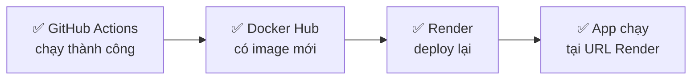

# CI/CD Setup Guide — Perfumora

## Files đã tạo

| File | Vị trí |
|---|---|
| GitHub Actions workflow | [ci-cd.yml](file:///f:/BAO_CAO/CHUYEN_NGANH/cn-da22tta-phamhuuluan-perfume-nodejs/.github/workflows/ci-cd.yml) |
| Docker Compose production | [docker-compose.prod.yml](file:///f:/BAO_CAO/CHUYEN_NGANH/cn-da22tta-phamhuuluan-perfume-nodejs/src/docker-compose.prod.yml) |

---

## Bước 1 — Docker Hub: Tạo Access Token

> [!IMPORTANT]
> Không dùng password Docker Hub trực tiếp — phải tạo **Access Token**.

1. Vào https://hub.docker.com → Đăng nhập
2. Click avatar góc trên phải → **Account Settings**
3. Chọn **Personal access tokens** → **Generate new token**
4. Đặt tên: `github-actions`, Permission: **Read & Write**
5. **Copy token ngay** (chỉ hiện 1 lần!)

---

## Bước 2 — GitHub: Thêm Secrets

Vào **GitHub repo → Settings → Secrets and variables → Actions → New repository secret**

Thêm lần lượt các secret sau:

| Secret Name | Giá trị |
|---|---|
| `DOCKERHUB_USERNAME` | Username Docker Hub của bạn |
| `DOCKERHUB_TOKEN` | Token vừa tạo ở Bước 1 |
| `REACT_APP_SERVER_URL` | URL server Render (thêm sau ở Bước 4) |
| `RENDER_DEPLOY_HOOK_SERVER` | Deploy hook Render server (thêm sau ở Bước 4) |
| `RENDER_DEPLOY_HOOK_CLIENT` | Deploy hook Render client (thêm sau ở Bước 4) |

---

## Bước 3 — Aiven: Lấy MySQL Connection

1. Vào https://aiven.io → Đăng nhập → **Create service → MySQL**
2. Chọn **Free plan** → Tên service: `perfumora-db`
3. Sau khi tạo xong, vào service → tab **Overview**
4. Copy các thông tin:
   - **Host** → `AIVEN_DB_HOST`
   - **Port** → `AIVEN_DB_PORT`
   - **User** → `AIVEN_DB_USER`
   - **Password** → `AIVEN_DB_PASSWORD`
   - **Database name** → `AIVEN_DB_NAME`

5. Import database: dùng **Query Editor** trên Aiven hoặc kết nối MySQL Workbench rồi chạy file [perfumedb.sql](file:///f:/BAO_CAO/CHUYEN_NGANH/cn-da22tta-phamhuuluan-perfume-nodejs/perfumedb.sql)

---

## Bước 4 — Render.com: Deploy Server

### Tạo Web Service cho SERVER

1. Vào https://render.com → **New → Web Service**
2. Chọn **Deploy an existing image from a registry**
3. Image URL: `docker.io/phamhuuluan/perfumora-server:latest`
4. Cấu hình:
   - **Name**: `perfumora-server`
   - **Instance Type**: Free
   - **Port**: `5000`
5. Thêm **Environment Variables** (click "Add Environment Variable"):
   ```
   NODE_ENV          = production
   PORT              = 5000
   CLIENT_URL        = https://perfumora-client.onrender.com  ← URL client Render (điền sau)
   SECRET_KEY        = (lấy từ .env local)
   JWT_RESET_SECRET  = (lấy từ .env local)
   DB_HOST           = (từ Aiven)
   DB_PORT           = (từ Aiven)
   DB_USER           = (từ Aiven)
   DB_PASSWORD       = (từ Aiven)
   DB_NAME           = (từ Aiven)
   EMAIL_PROVIDER    = gmail
   EMAIL_USER        = (email của bạn)
   EMAIL_PASS        = (app password gmail)
   ```
6. **Create Web Service** → copy URL (vd: `https://perfumora-server.onrender.com`)
7. Vào **Settings → Deploy Hook** → copy URL → thêm vào GitHub Secret `RENDER_DEPLOY_HOOK_SERVER`

### Tạo Web Service cho CLIENT

1. **New → Web Service** → **Deploy existing image**
2. Image URL: `docker.io/phamhuuluan/perfumora-client:latest`
3. Cấu hình:
   - **Name**: `perfumora-client`
   - **Port**: `80`
4. Environment Variables:
   ```
   REACT_APP_SERVER_URL = https://perfumora-server.onrender.com
   ```
5. **Create** → copy Deploy Hook → thêm vào GitHub Secret `RENDER_DEPLOY_HOOK_CLIENT`
6. Quay lại **cập nhật** Secret `REACT_APP_SERVER_URL` với URL server thật

---

## Bước 5 — Push code lần đầu để test

```bash
git add .
git commit -m "ci: add GitHub Actions CI/CD pipeline"
git push origin main
```

Sau đó vào tab **Actions** trên GitHub repo → xem pipeline chạy.

---

## Kiểm tra kết quả



| Kiểm tra | Ở đâu |
|---|---|
| Pipeline chạy | GitHub → tab **Actions** |
| Image được push | hub.docker.com → Repositories |
| Deploy thành công | Render → **Deploys** tab |
| App hoạt động | URL Render của client |

---

## Lỗi thường gặp

| Lỗi | Nguyên nhân | Cách fix |
|---|---|---|
| `unauthorized` Docker Hub | Token sai hoặc hết hạn | Tạo lại token, cập nhật secret |
| Build failed | Dockerfile lỗi | Xem log chi tiết trong Actions |
| Render không deploy | Deploy hook URL sai | Copy lại đúng URL trong Settings |
| DB connection refused | Sai creds Aiven | Kiểm tra lại host/port/user/pass |
